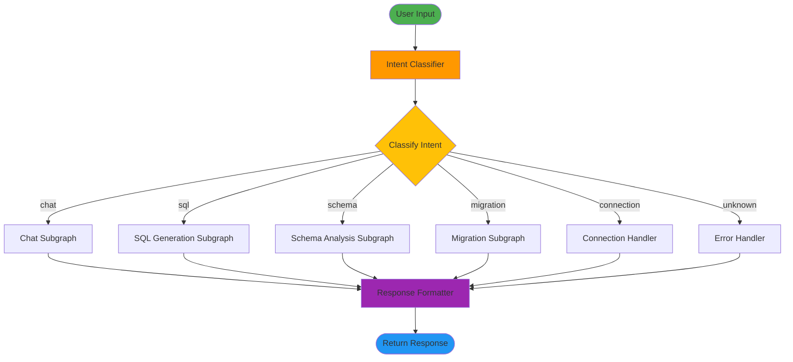
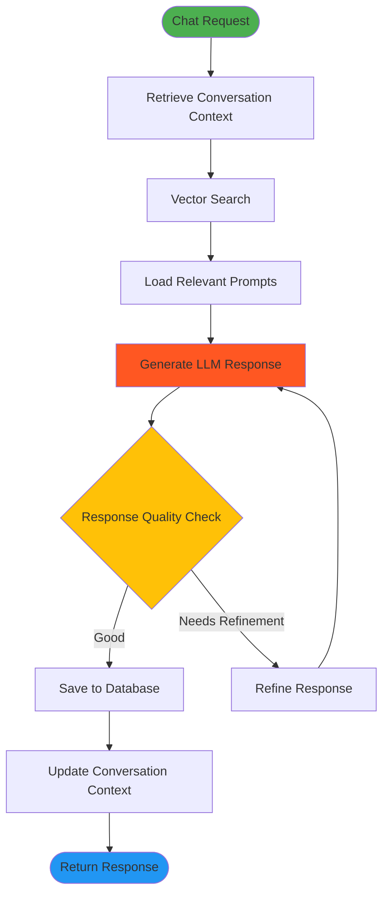
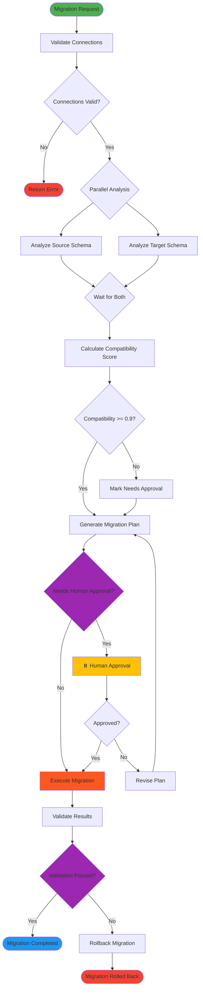
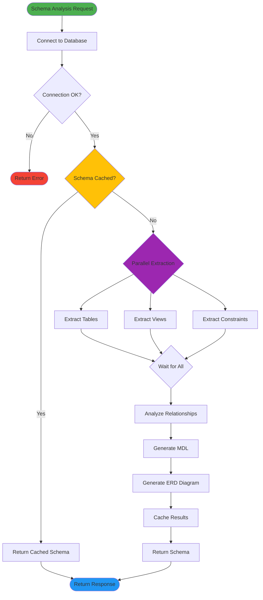
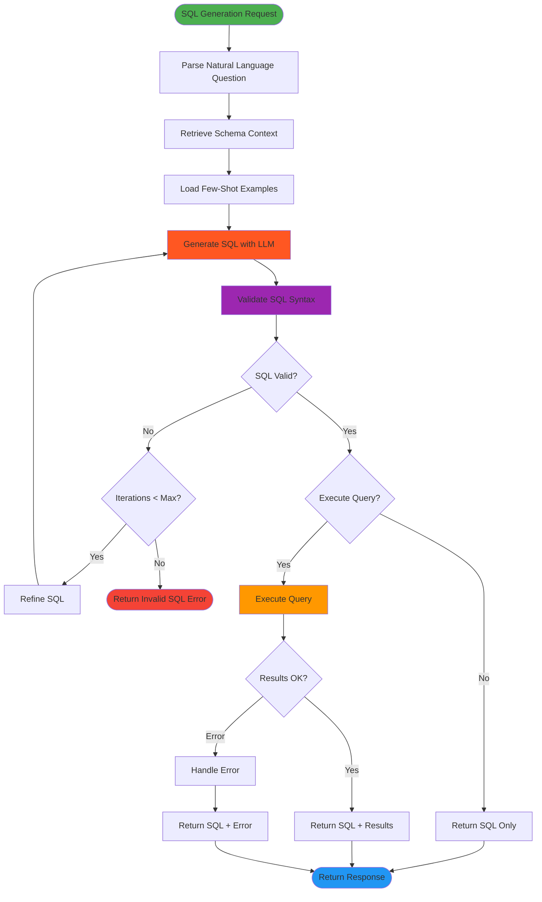
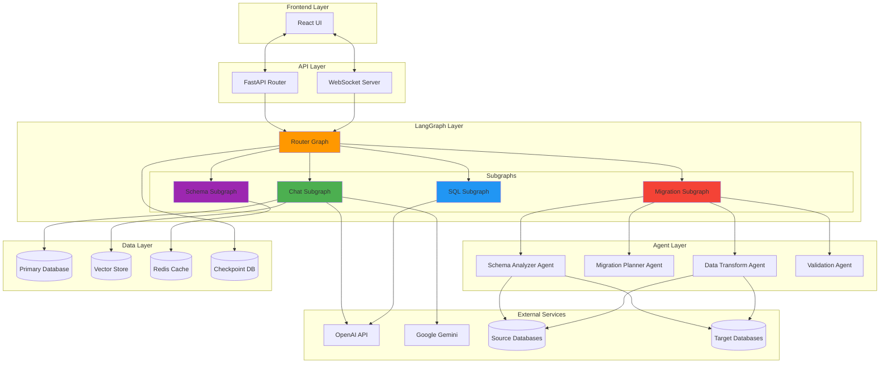
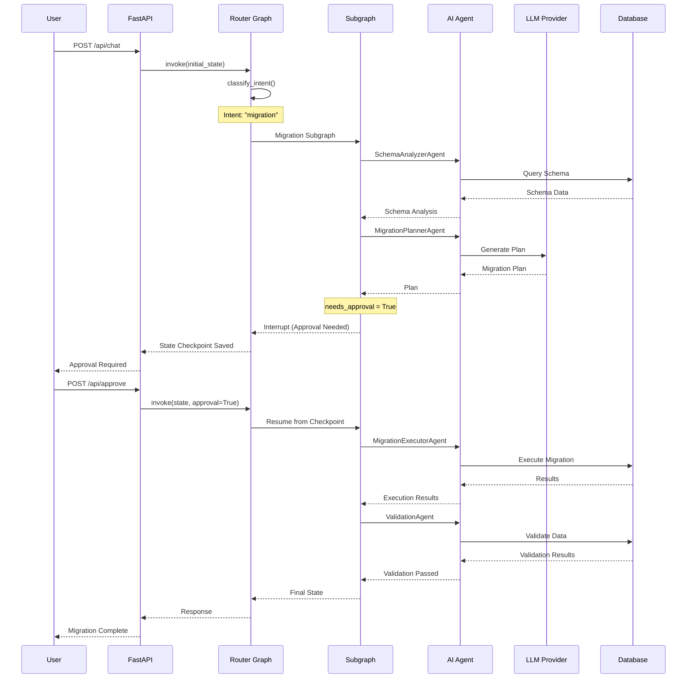
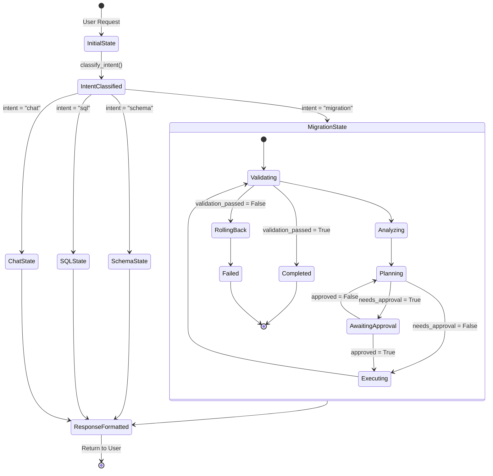
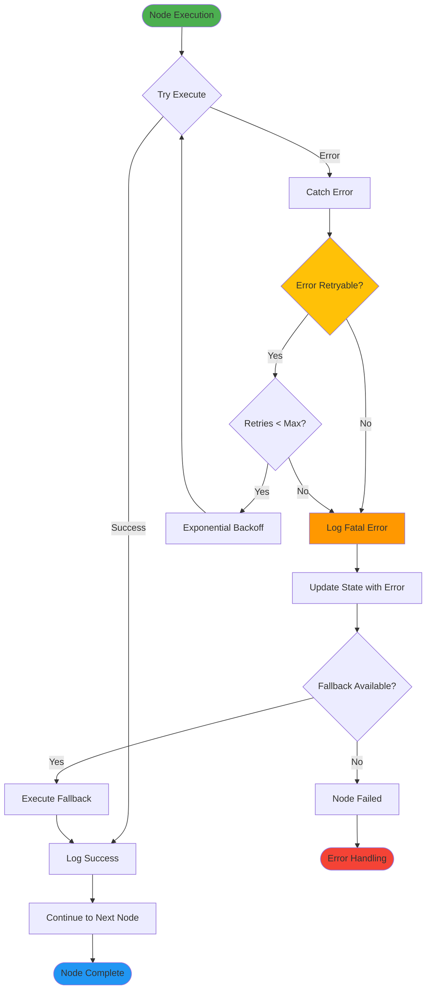
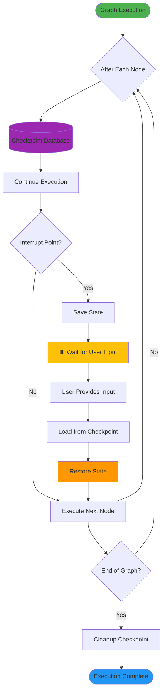

# LangGraph Flow Diagrams

## 📊 Visualizations cho LangGraph Architecture

Tài liệu này chứa các biểu đồ Mermaid để visualize LangGraph flows.

---

## 🎯 1. Router Graph - Main Orchestrator



---

## 💬 2. Chat Subgraph



---

## 🔄 3. Migration Subgraph (Detailed)



---

## 🔍 4. Schema Analysis Subgraph



---

## 💡 5. SQL Generation Subgraph



---

## 🏗️ 6. Complete System Architecture with LangGraph



---

## 🔄 7. State Flow Through System



---

## 📦 8. State Management Flow



---

## 🔧 9. Error Handling & Retry Flow



---

## 📊 10. Checkpoint & Recovery Flow



---

## 🎨 Visual Representation Guide

### Cách đọc các biểu đồ:

#### Màu sắc:
- 🟢 **Green** (#4CAF50): Entry points / Start nodes
- 🔵 **Blue** (#2196F3): Exit points / End nodes
- 🔴 **Red** (#F44336): Error states / Rollback
- 🟠 **Orange** (#FF9800): Processing nodes / Important logic
- 🟡 **Yellow** (#FFC107): Decision points / Conditions
- 🟣 **Purple** (#9C27B0): Special operations / Parallel execution

#### Hình dạng:
- **Rectangle**: Processing node
- **Diamond**: Decision/Conditional
- **Rounded Rectangle**: Start/End
- **Cylinder**: Database
- **Parallelogram**: Input/Output

#### Mũi tên:
- **Solid**: Normal flow
- **Dashed**: Optional/Conditional flow
- **Bold**: Main path

---

## 📖 Sử dụng diagrams

### 1. Trong VS Code:
- Cài extension: "Markdown Preview Mermaid Support"
- Mở file này và preview

### 2. Trong Documentation:
- Copy vào MkDocs/Docusaurus
- Sử dụng mermaid plugin

### 3. Export hình ảnh:
```bash
# Sử dụng mermaid-cli
npm install -g @mermaid-js/mermaid-cli
mmdc -i LANGGRAPH_FLOW_DIAGRAMS.md -o output.png
```

---

**Last Updated**: 2025-01-26  
**Version**: 1.0.0
