# AI Agent-Based Data Migration - Visual Diagrams

This document contains comprehensive visual diagrams for the AI-powered data migration system.

---

## 🔄 Migration Workflow Overview

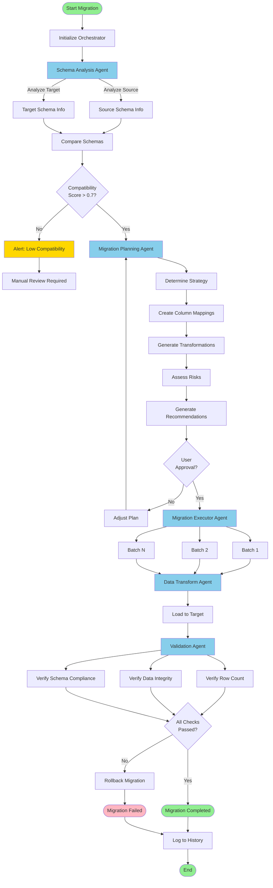

---

## 🤖 AI Agent Architecture

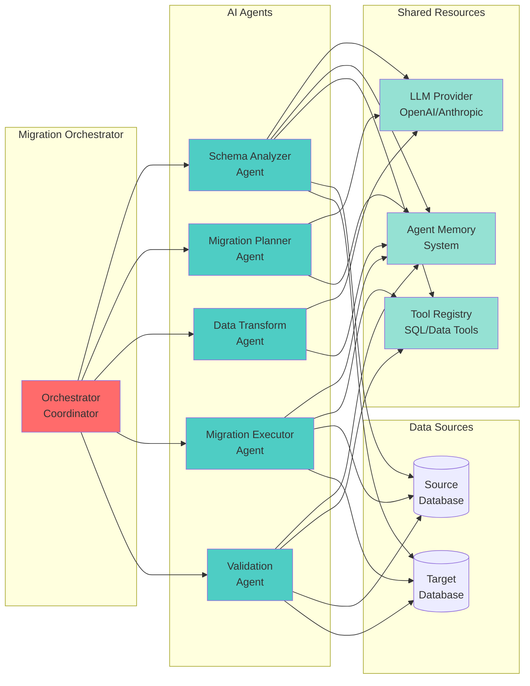

---

## 📊 Schema Analysis Process

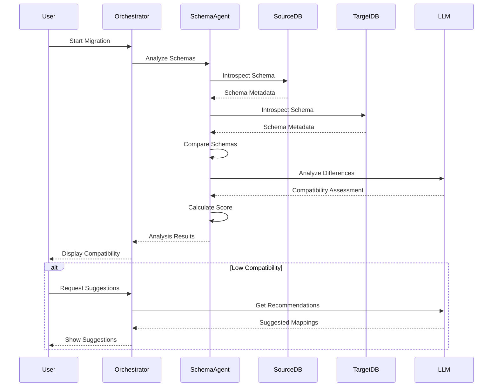

---

## 🔄 Data Transformation Pipeline

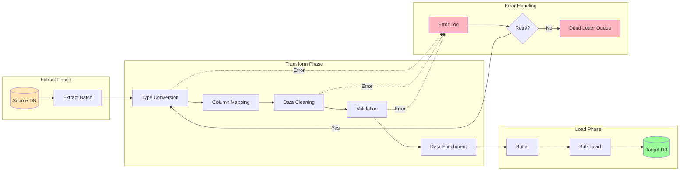

---

## 📈 Migration Strategies

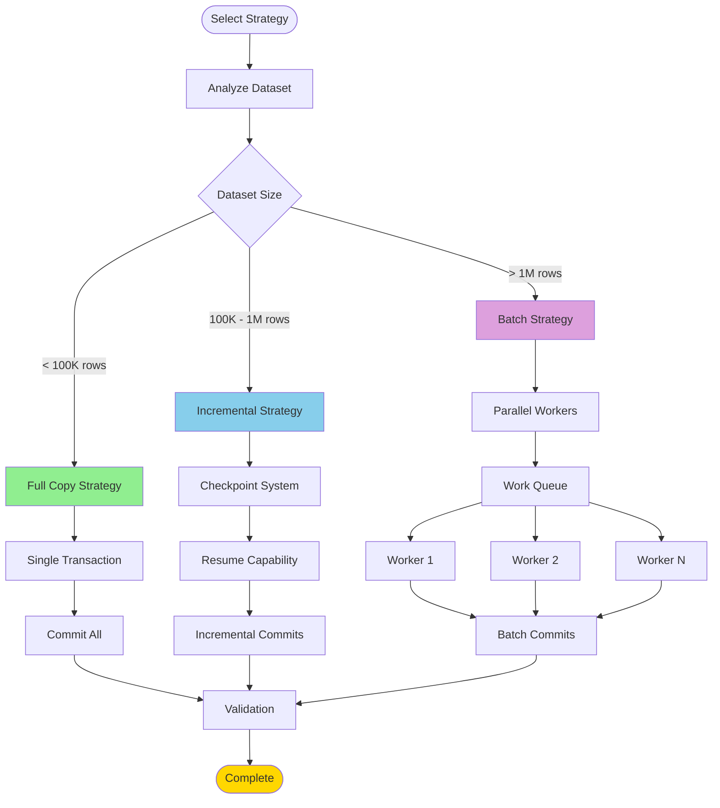

---

## 🔍 Validation Process

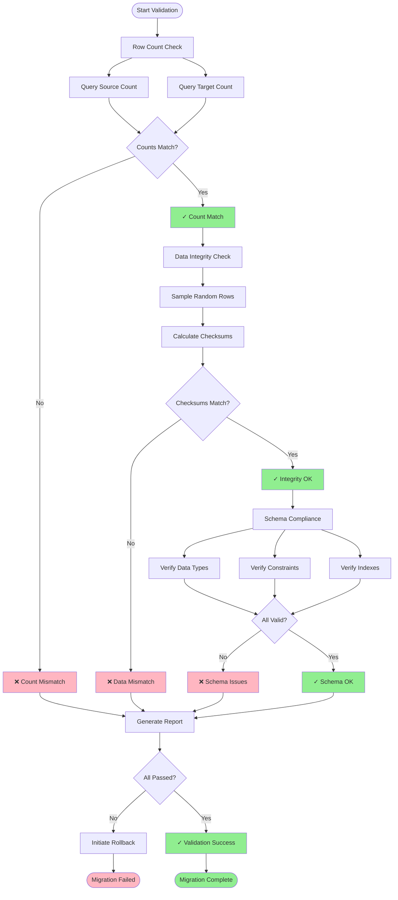

---

## 🎯 Agent Decision Flow

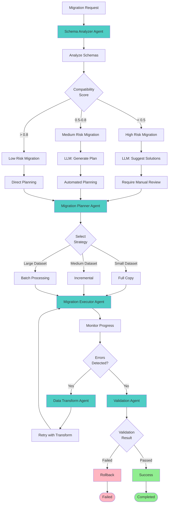

---

## 🔐 Security & Compliance Flow

```mermaid
graph LR
    subgraph "Pre-Migration Security"
        Auth[Authentication]
        Authz[Authorization]
        Encrypt[Encrypt Credentials]
    end
    
    subgraph "During Migration"
        Audit[Audit Logging]
        Monitor[Security Monitoring]
        Mask[Data Masking]
    end
    
    subgraph "Post-Migration"
        Verify[Verify Integrity]
        Cleanup[Cleanup Temp Data]
        Report[Security Report]
    end
    
    Start([Start]) --> Auth
    Auth --> Authz
    Authz --> Encrypt
    
    Encrypt --> Audit
    Audit --> Monitor
    Monitor --> Mask
    
    Mask --> Verify
    Verify --> Cleanup
    Cleanup --> Report
    
    Report --> End([End])
    
    style Auth fill:#FFB6C1
    style Authz fill:#FFB6C1
    style Encrypt fill:#FFB6C1
    style Audit fill:#87CEEB
    style Monitor fill:#87CEEB
    style Verify fill:#90EE90
```

---

## 📊 Performance Monitoring

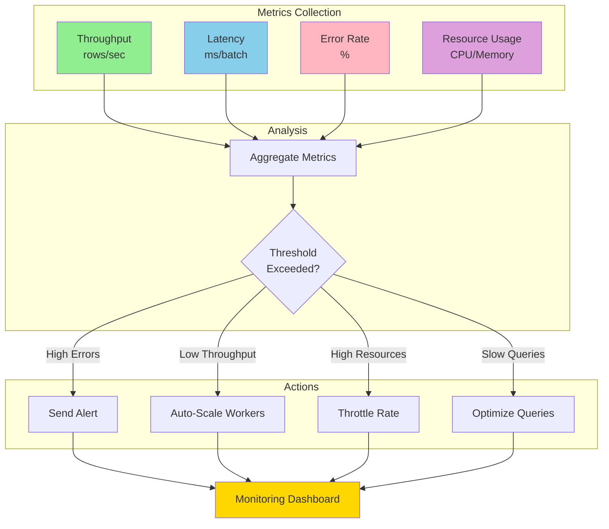

---

## 🔄 Rollback Mechanism

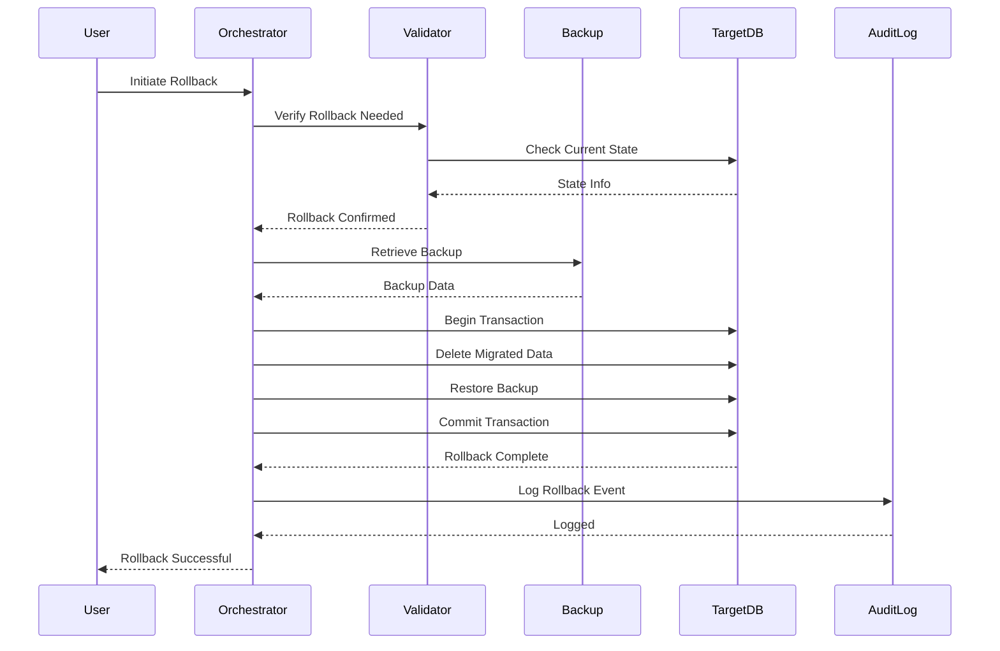

---

## 📈 Migration Analytics Dashboard

```mermaid
graph TB
    subgraph "Real-Time Metrics"
        Progress[Progress: 45%]
        Speed[Speed: 10K rows/sec]
        ETA[ETA: 15 minutes]
    end
    
    subgraph "Historical Data"
        TotalMig[Total Migrations: 127]
        SuccessRate[Success Rate: 98.4%]
        AvgDuration[Avg Duration: 8.5 min]
    end
    
    subgraph "Current Status"
        Status[Status: Executing]
        Worker1[Worker 1: Active]
        Worker2[Worker 2: Active]
        Worker3[Worker 3: Idle]
    end
    
    subgraph "Alerts"
        Warning1[⚠ High Memory Usage]
        Info1[ℹ Checkpoint Saved]
    end
    
    Dashboard[Migration Dashboard]
    
    Dashboard --> Progress
    Dashboard --> Speed
    Dashboard --> ETA
    Dashboard --> TotalMig
    Dashboard --> SuccessRate
    Dashboard --> AvgDuration
    Dashboard --> Status
    Dashboard --> Worker1
    Dashboard --> Worker2
    Dashboard --> Worker3
    Dashboard --> Warning1
    Dashboard --> Info1
    
    style Dashboard fill:#FFD700
    style Progress fill:#87CEEB
    style Status fill:#90EE90
    style Warning1 fill:#FFB6C1
```

---

**Generated**: 2025-01-18  
**Version**: 1.0.0  
**Tool**: Mermaid Diagram Syntax
