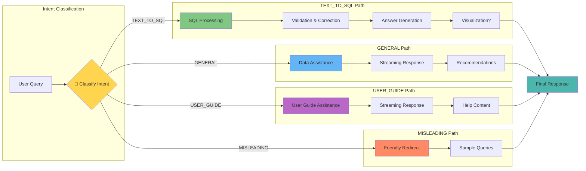
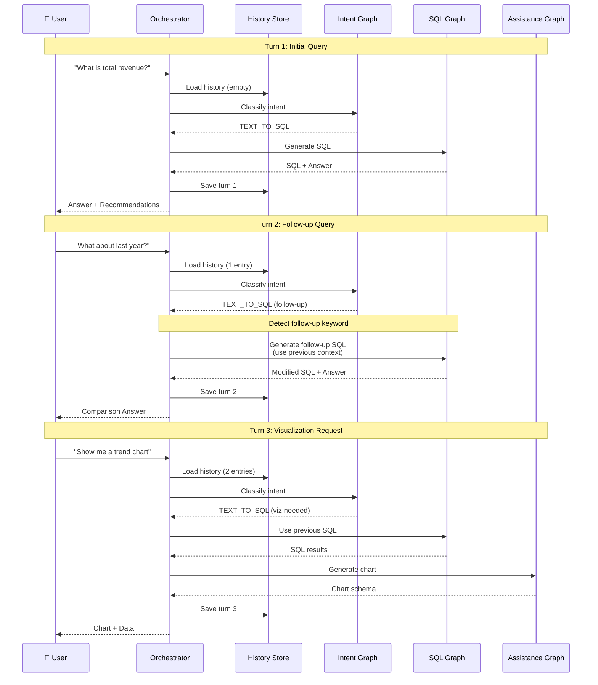
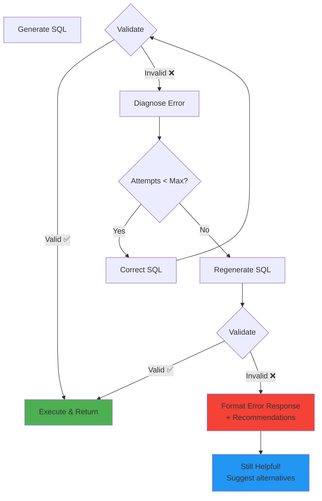
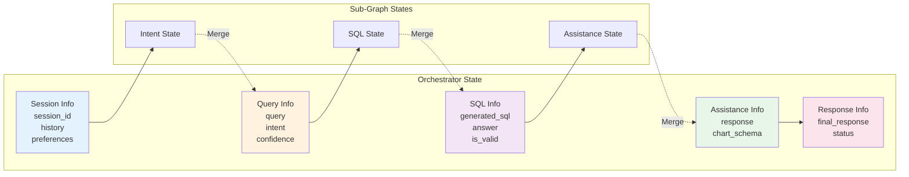
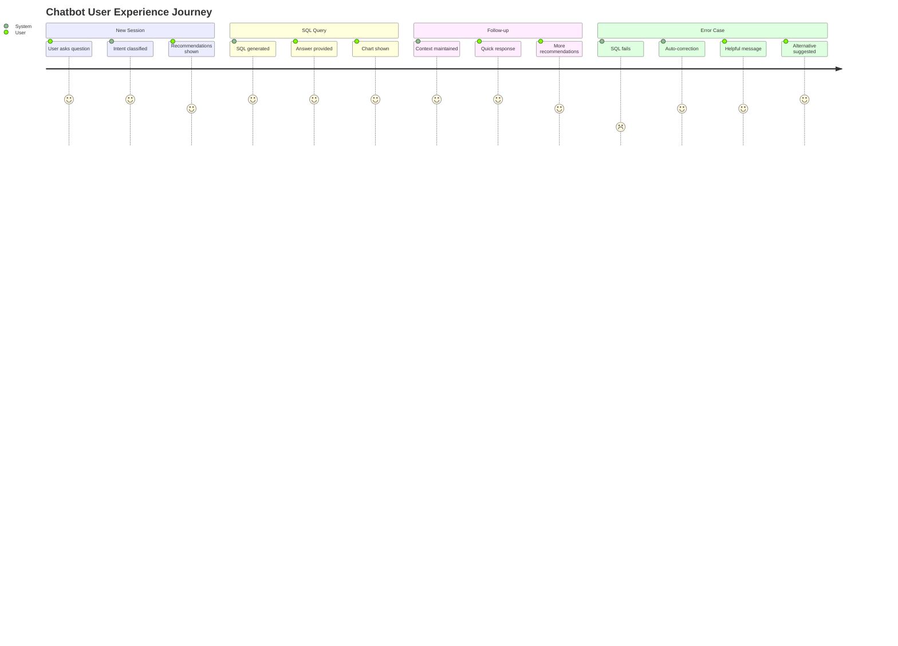
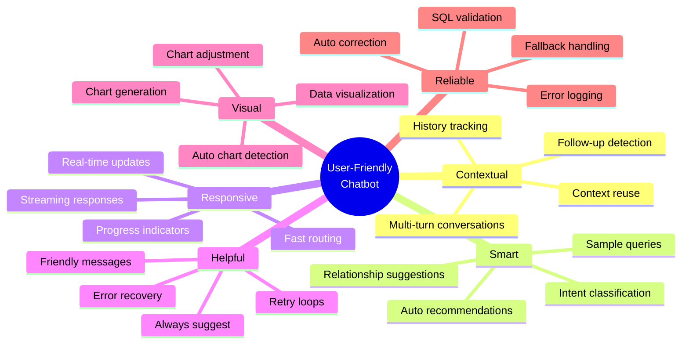

# User-Friendly Workflow Architecture

## Complete System Diagram

```mermaid
graph TB
    subgraph "User Interface"
        USER[👤 User]
        CHAT[💬 Chat Interface]
    end
    
    subgraph "Master Orchestrator"
        INIT[🚀 Initialize Session<br/>Load History & Preferences]
        
        subgraph "Graph 1: Intent & Recommendation"
            IC[🎯 Intent Classification<br/>TEXT_TO_SQL | GENERAL | USER_GUIDE | MISLEADING]
            QR[💡 Question Recommendation]
            SD[📖 Semantics Description]
            RR[🔗 Relationship Recommendation]
        end
        
        ROUTE{🔀 Route by Intent}
        
        subgraph "Graph 2: SQL Processing"
            CF[🔁 Check Follow-up]
            SR[🧠 SQL Reasoning]
            SG[⚙️ SQL Generation]
            FSR[🧠 Follow-up SQL Reasoning]
            FSG[⚙️ Follow-up SQL Generation]
            VAL{✅ Validate SQL}
            DIAG[🔍 SQL Diagnosis]
            CORR[🔧 SQL Correction]
            REGEN[🔄 SQL Regeneration]
            EXT[📊 Extract Tables]
            QUEST[❓ SQL Question]
            ANS[💬 SQL Answer]
        end
        
        subgraph "Graph 3: Assistance & Visualization"
            DA[📚 Data Assistance<br/>Streaming]
            UG[📖 User Guide<br/>Streaming]
            MIS[⚠️ Misleading Assistance]
            CG[📊 Chart Generation]
            CA[🎨 Chart Adjustment]
        end
        
        VIZ{📊 Need Visualization?}
        STREAM{🌊 Enable Streaming?}
        SR_NODE[🌊 Stream Response]
        FORMAT[📦 Format Final Response]
        SAVE[💾 Save History]
        ERR[⚠️ Handle Error]
    end
    
    subgraph "Data Layer"
        DB[(🗄️ Database)]
        CACHE[(⚡ Cache)]
        HISTORY[(📚 History Store)]
    end
    
    %% User Flow
    USER --> CHAT
    CHAT --> INIT
    
    %% Session Init
    INIT --> IC
    HISTORY -.Load History.-> INIT
    CACHE -.Load Preferences.-> INIT
    
    %% Intent & Recommendation Flow
    IC --> QR
    IC --> SD
    SD --> RR
    QR --> ROUTE
    RR --> ROUTE
    
    %% Intent Routing
    ROUTE -->|TEXT_TO_SQL| CF
    ROUTE -->|GENERAL| DA
    ROUTE -->|USER_GUIDE| UG
    ROUTE -->|MISLEADING| MIS
    ROUTE -->|ERROR| ERR
    
    %% SQL Processing Flow
    CF -->|New Query| SR
    CF -->|Follow-up| FSR
    SR --> SG
    FSR --> FSG
    SG --> VAL
    FSG --> VAL
    
    VAL -->|Valid| EXT
    VAL -->|Invalid| DIAG
    DIAG --> CORR
    CORR --> VAL
    VAL -->|Max Retries| REGEN
    REGEN --> VAL
    
    EXT --> QUEST
    QUEST --> ANS
    ANS --> VIZ
    
    DB -.Execute SQL.-> ANS
    
    %% Visualization Check
    VIZ -->|Yes| CG
    VIZ -->|No| FORMAT
    
    %% Assistance Flow
    DA --> STREAM
    UG --> STREAM
    MIS --> FORMAT
    
    %% Chart Flow
    CG --> CA
    CA --> FORMAT
    
    %% Streaming Check
    STREAM -->|Yes| SR_NODE
    STREAM -->|No| FORMAT
    SR_NODE --> FORMAT
    
    %% Final Steps
    FORMAT --> SAVE
    ERR --> SAVE
    SAVE --> CHAT
    SAVE -.Save.-> HISTORY
    SAVE -.Update.-> CACHE
    
    CHAT --> USER
    
    %% Styling
    classDef userClass fill:#e1f5ff,stroke:#01579b,stroke-width:2px
    classDef graphClass fill:#fff3e0,stroke:#e65100,stroke-width:2px
    classDef sqlClass fill:#f3e5f5,stroke:#4a148c,stroke-width:2px
    classDef assistClass fill:#e8f5e9,stroke:#1b5e20,stroke-width:2px
    classDef dataClass fill:#fce4ec,stroke:#880e4f,stroke-width:2px
    
    class USER,CHAT userClass
    class IC,QR,SD,RR graphClass
    class CF,SR,SG,FSR,FSG,VAL,DIAG,CORR,REGEN,EXT,QUEST,ANS sqlClass
    class DA,UG,MIS,CG,CA assistClass
    class DB,CACHE,HISTORY dataClass
```

## Intent-Based Routing Flow



## Multi-Turn Conversation Flow



## Error Recovery Flow



## State Management



## User Experience Flow



## Key User-Friendly Features


